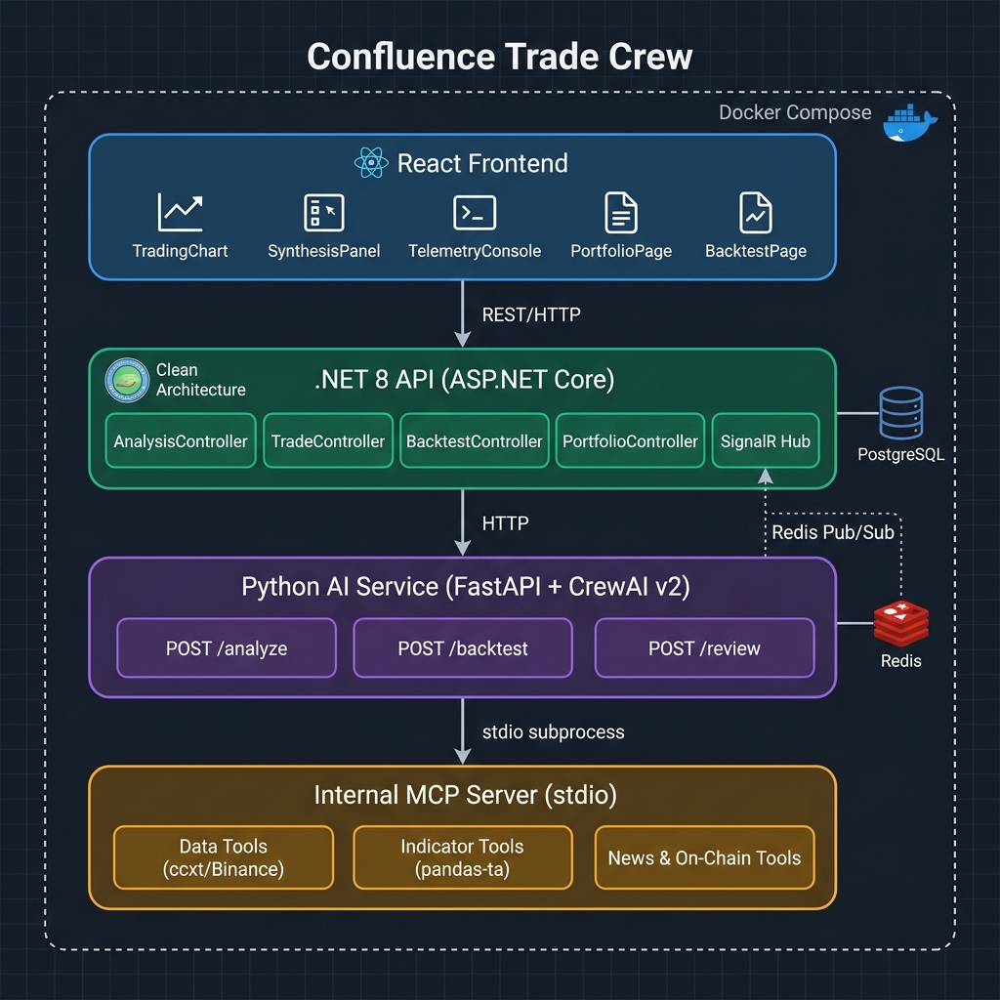
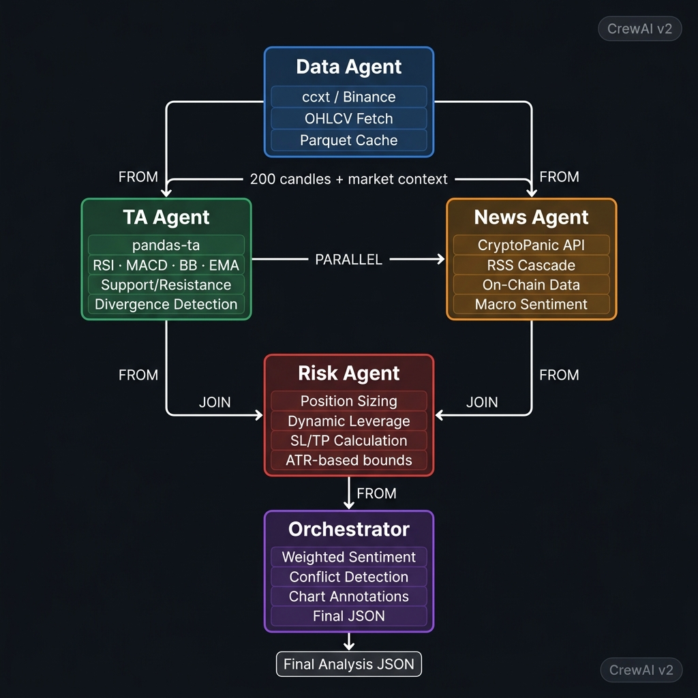
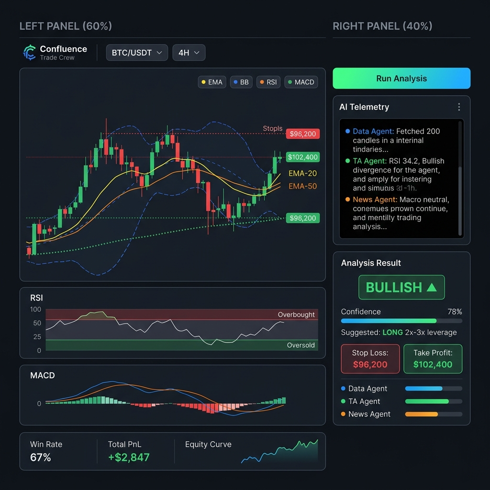

# Confluence Trade Crew

<div align="center">

**A multi-agent AI system for cryptocurrency analysis and professional trade journaling**

*Powered by CrewAI · FastAPI · .NET 8 · React 18*

[](https://www.python.org/)
[](https://dotnet.microsoft.com/)
[](https://reactjs.org/)
[](https://fastapi.tiangolo.com/)
[](https://crewai.com/)
[](https://docs.docker.com/compose/)
[](LICENSE)

> **Not a trading bot.** A decision-support system — the AI analyses, you decide.

</div>

---

## Overview

Confluence Trade Crew is a self-hosted, multi-agent decision-support platform for crypto traders. You provide a trading pair, timeframe, balance, and risk tolerance. A five-agent CrewAI pipeline runs technical analysis, news sentiment, on-chain signals, and risk sizing in parallel — then synthesizes a structured recommendation with chart annotations. You review the output, decide whether to act, and manually log your trades.

All agent reasoning is streamed live to the UI via Redis Pub/Sub → SignalR WebSockets, giving you a transparent "thought process" window as the AI works. Every analysis and trade is persisted in PostgreSQL and accessible through a professional trading journal with equity curves, drawdown metrics, and execution quality scoring.

---

## Architecture



The system is built on strict layer separation across four tiers, all orchestrated by Docker Compose:

| Layer | Technology | Responsibility |
|-------|-----------|---------------|
| **Frontend** | React 18, Vite, lightweight-charts, Zustand | UI, charting, real-time telemetry display |
| **.NET 8 API** | ASP.NET Core, EF Core, PostgreSQL, SignalR | Business logic, data ownership, trade lifecycle |
| **Python AI Service** | FastAPI, CrewAI v2, pandas | Stateless multi-agent analysis engine |
| **Internal MCP Server** | Python MCP SDK (stdio transport) | Tool abstraction layer for agents |

**Key architectural constraint:** The Python AI Service writes no data to any database. PostgreSQL is the exclusive domain of the .NET API layer. This stateless design makes the AI service independently testable and horizontally scalable.

---

## The AI Pipeline



### Five Specialized Agents

The pipeline is designed with explicit dependency management — Data Agent runs first, TA and News agents run in parallel, Risk Agent joins their outputs, and the Orchestrator synthesizes everything:

```
[Data Agent]
      │
      ├──────────────────────────┐
      ▼                           ▼
[TA Agent]              [News + OnChain Agent]
(pandas-ta, MCP tools)  (CryptoPanic, RSS, Binance Futures)
      │                           │
      └──────────┬────────────────┘
                  ▼
          [Risk Agent]
          (ATR-based SL/TP, dynamic leverage)
                  │
                  ▼
         [Orchestrator]
         (Weighted synthesis, conflict detection, chart annotations)
                  │
                  ▼
         Structured JSON → .NET API → PostgreSQL → Frontend
```

#### Agent Roles

| Agent | Role | Key Tools (MCP) |
|-------|------|-----------------|
| **Data Agent** | Fetches OHLCV candles, prepares shared market context | `get_ohlcv` → ccxt → Binance |
| **TA Agent** | Computes indicators, detects divergence & S/R levels | `calculate_indicator` (pandas-ta), `detect_divergence`, `get_support_resistance` |
| **News Agent** | Pair-specific + macro sentiment in two layers | `get_pair_news` (CryptoPanic), RSS cascade (CoinDesk, CoinTelegraph, Decrypt) |
| **OnChain Agent** | Derivatives market signals | `get_funding_rate`, `get_open_interest`, `get_long_short_ratio` (Binance Futures) |
| **Risk Agent** | Position sizing, SL/TP, dynamic leverage bounds | `get_volatility_metrics`, ATR-based calculations |
| **Orchestrator** | Weighted sentiment synthesis, conflict detection, chart annotations | — (pure synthesis) |

### Engineering Decisions

**ReAct over Pydantic output constraints.** CrewAI v2's `output_pydantic` forces sub-agents to prioritize schema generation over tool exploration, breaking the ReAct loop. We removed `output_pydantic` from all sub-agents — they output plain text and explore tools freely. Only the Orchestrator enforces a strict JSON schema, ensuring structured output without sacrificing reasoning quality.

**LLM Strategy Pattern with multi-provider factory.** `LLMFactory` resolves the correct API key environment variable from the model string prefix (`anthropic/`, `openai/`, `gemini/`, `github_models/`, `ollama/`). Each agent can use a different provider, enabling zero-code switching and GitHub Models' 150 req/day per-model limit to be distributed across 5 models for 750 effective requests/day.

**Parquet file-based OHLCV cache.** CrewAI's `MCPServerStdio` spawns a fresh subprocess per tool call, destroying all in-memory state. We persist shared DataFrames as Parquet files keyed by session UUID, surviving subprocess restarts. Cache is cleared after each analysis session.

**RSS-first news strategy.** DuckDuckGo rate-limits IPs aggressively. The fallback chain is: CryptoPanic API (if key provided) → CoinDesk RSS → CoinTelegraph RSS → Decrypt RSS → DuckDuckGo (last resort). Empty list is returned when no keyword matches, triggering a low-confidence report instead of generic headlines.

---

## Features

### 🤖 Multi-Agent AI Pipeline
- Five specialized CrewAI v2 agents with explicit dependency ordering
- TA and News agents run in parallel; Risk Agent joins their outputs at a defined sync point
- Each agent uses the Internal MCP Server for tool calls (data, indicators, news, on-chain)
- Live agent thought process streamed to the UI via Redis Pub/Sub → SignalR → WebSockets

### 📊 Advanced Charting
- Candlestick chart powered by `lightweight-charts` (TradingView OSS)
- Client-side indicator overlays: EMA-20, EMA-50, Bollinger Bands
- RSI(14) and MACD(12,26,9) sub-panes synchronized with the main chart
- AI-generated chart annotations: support/resistance lines, divergence markers, SL/TP levels

### 📔 Professional Trading Journal
- Manual trade entry and exit with execution quality scoring (Good/Fair/Poor)
- Chart snapshot capture at entry and exit using the lightweight-charts screenshot API
- Tag system (breakout, reversal, trend-following, news-driven, etc.) with multi-select chip UI
- Advanced portfolio metrics: Equity Curve, Max Drawdown, Expectancy, Recovery Factor, Sharpe/Sortino, Average R:R, monthly PnL breakdown, win/loss streaks

### 🔁 Multi-Timeframe Confluence
- Single-click toggle to run analysis across multiple timeframes (1h, 4h, 1d, etc.)
- Confluence Gauge component showing directional agreement across timeframes
- MTF results persisted to the database for historical comparison

### ⏱️ Vectorized Backtesting Engine
- Historical strategy simulation without LLM calls — completes in under 1 second
- `BacktestEngine` converts Orchestrator signal logic into a Pandas vectorized algorithm
- ccxt bulk fetch → pandas signal generation → equity curve → trade-by-trade breakdown
- Optional trading fee simulation and max-trade limits for realistic results

### 🔍 AI Trade Review Assistant
- On-demand AI evaluation of closed trades via a single direct LLM call (no CrewAI overhead)
- Evaluates: Plan Adherence, SL/TP Rationality, Timing (early/late/optimal), Improvement Advice
- Integrated into the Trades Journal and Analysis Detail pages with glassmorphism UI

### 🎯 Model Accuracy Tracking
- Post-analysis, the system queries Binance for actual price movements at 1h, 4h, 24h intervals
- Calculates whether SL/TP targets were hit and logs an accuracy score
- Global accuracy statistics in Portfolio page; per-analysis accuracy badge in History

### 📋 Strategy Templates
- Preset strategy profiles: Scalp, Intraday, Swing, Position
- Custom builder in Settings: configure timeframe set, minimum R:R, indicator/news weights
- Strategy selection persists with each analysis for historical review

### 🔔 Alert System
- Dashboard widget surfacing high-confidence, non-neutral recent signals
- Analysis Comparison: side-by-side view of two historical analyses

---

## UI Preview



---

## Tech Stack

| Layer | Technology | Version |
|-------|-----------|---------|
| Frontend | React, Vite, lightweight-charts (TradingView OSS), Zustand | React 18, Vite 5 |
| API | ASP.NET Core, EF Core, PostgreSQL | .NET 8 |
| Real-Time | Redis Pub/Sub, SignalR | Redis 7 |
| AI Service | Python, FastAPI, CrewAI | Python 3.12, CrewAI v2 |
| MCP Server | Python MCP SDK (stdio transport) | — |
| LLM Providers | Anthropic, OpenAI, Gemini, GitHub Models, Ollama | Multi-provider |
| Market Data | ccxt (Binance), Binance Futures API | — |
| Indicators | pandas-ta, custom divergence/S&R detection | — |
| News | CryptoPanic API, RSS (CoinDesk, CoinTelegraph, Decrypt) | — |
| Deployment | Docker Compose, multi-stage Docker builds | Compose v2 |
| Database | PostgreSQL (Docker named volume) | Postgres 16 |

---

## Project Structure

```
confluence-trade-crew/
├── ai-service/                          # Python AI Service
│   ├── app/
│   │   ├── api/                         # FastAPI endpoints (/analyze, /backtest, /review)
│   │   ├── crew/
│   │   │   ├── prompts/                 # Per-agent prompt engineering files
│   │   │   │   ├── data_agent.py        # Data context prompt
│   │   │   │   ├── ta_agent.py          # Technical analysis prompt
│   │   │   │   ├── news_agent.py        # News & sentiment prompt
│   │   │   │   ├── risk_agent.py        # Direction-aware risk calculation prompt
│   │   │   │   ├── onchain_agent.py     # Funding / OI / LS ratio prompt
│   │   │   │   └── orchestrator.py      # Synthesis & conflict detection prompt
│   │   │   └── confluence_crew.py       # CrewAI task graph & telemetry callbacks
│   │   ├── llm/
│   │   │   ├── factory.py               # Multi-provider LLM factory (Strategy Pattern)
│   │   │   └── config.py                # Provider → API key mapping
│   │   ├── mcp_server/
│   │   │   ├── tools/
│   │   │   │   ├── data_tools.py        # get_ohlcv (ccxt → Binance)
│   │   │   │   ├── indicator_tools.py   # calculate_indicator, detect_divergence, S&R
│   │   │   │   ├── news_tools.py        # CryptoPanic + RSS cascade + article scraper
│   │   │   │   └── onchain_tools.py     # Funding rate, OI, Long/Short ratio
│   │   │   ├── cache.py                 # Parquet file-based OHLCV session cache
│   │   │   └── server.py                # MCP protocol handler (stdio transport)
│   │   ├── schemas/                     # Pydantic request/response models
│   │   └── services/
│   │       ├── analysis_orchestrator.py # Single-TF pipeline entry point
│   │       ├── multi_tf_orchestrator.py # Multi-timeframe confluence engine
│   │       ├── backtest_engine.py       # Vectorized pandas backtesting engine
│   │       ├── trade_review_engine.py   # Direct LLM trade evaluation
│   │       └── telemetry_publisher.py   # Redis Pub/Sub agent step publisher
│   ├── Dockerfile
│   └── requirements.txt
│
├── api/                                 # .NET 8 API — Clean Architecture
│   └── src/
│       ├── Confluence.API/
│       │   ├── Controllers/             # 9 controllers (Analysis, Trade, Portfolio, Backtest...)
│       │   ├── Hubs/                    # SignalR AnalysisHub (WebSocket broadcast)
│       │   └── BackgroundServices/      # RedisTelemetrySubscriber (Redis → SignalR)
│       ├── Confluence.Application/      # DTOs, service interfaces, application services
│       ├── Confluence.Domain/           # Entities: Trade, Analysis, Pair, UserSettings,
│       │                                #   StrategyTemplate, TradeReview, AnalysisAccuracy
│       └── Confluence.Infrastructure/   # EF Core DbContext, migrations, repositories
│
├── frontend/                            # React 18 SPA
│   └── src/
│       ├── components/
│       │   ├── Analysis/                # ControlPanel, SynthesisPanel, TelemetryConsole,
│       │   │                            #   ConfluenceGauge, AccuracyDashboard, AlertWidget
│       │   ├── Chart/                   # TradingChart (lightweight-charts + indicator overlays)
│       │   ├── Trade/                   # TradeForm, TradeReviewPanel, SnapshotLightbox
│       │   └── Backtest/               # BacktestDashboard
│       ├── hooks/                       # useBinanceData, useAnalysisLogic
│       ├── pages/                       # Dashboard, Trading, Portfolio, Backtest,
│       │                                #   History, Compare, Trades, Settings, Landing
│       ├── services/                    # apiClient.js, signalrClient.js
│       └── store/                       # Zustand state management
│
├── docs/
│   ├── architecture.md                  # Layer responsibilities and data flow
│   ├── agents.md                        # Agent I/O schemas and pipeline details
│   ├── mcp_tools.md                     # MCP tool definitions and schemas
│   ├── db_schema.md                     # PostgreSQL schema, indexes, PnL calculation
│   └── setup.md                         # Full setup guide, env vars, troubleshooting
│
├── docker-compose.yml                   # 5-service orchestration (db, redis, ai-service, api, frontend)
├── .env.example                         # Multi-provider LLM configuration reference
└── README.md
```

---

## Quick Start

> Full setup guide including troubleshooting and network configuration: [`docs/setup.md`](docs/setup.md)

### Prerequisites

- Docker and Docker Compose v2+
- At least one LLM provider API key (see Configuration below)
- Binance API key/secret *(optional — raises rate limits for market data)*
- CryptoPanic API key *(optional — enables pair-specific news)*

### 1. Clone

```bash
git clone https://github.com/aeren23/confluence-trade-crew.git
cd confluence-trade-crew
```

### 2. Configure

```bash
cp .env.example .env
# Edit .env — set at least one LLM provider key
```

### 3. Run

```bash
docker compose up --build
```

### 4. Open

| Service | URL |
|---------|-----|
| Frontend | [http://localhost:3000](http://localhost:3000) |
| .NET API health | [http://localhost:5000/health](http://localhost:5000/health) |
| AI Service health | [http://localhost:8000/health](http://localhost:8000/health) |

---

## Configuration

The `.env.example` file contains a full multi-provider reference. Pick any supported LLM provider for each agent — or use the same for all:

```bash
# --- Anthropic (Claude) ---
# ANTHROPIC_API_KEY=sk-ant-...
# DATA_AGENT_MODEL=anthropic/claude-3-5-haiku-20241022

# --- OpenAI ---
# OPENAI_API_KEY=sk-...
# DATA_AGENT_MODEL=openai/gpt-4o-mini

# --- Google Gemini ---
# GEMINI_API_KEY=AIza...
# DATA_AGENT_MODEL=gemini/gemini-1.5-flash

# --- GitHub Models (free tier: 150 req/day per model) ---
# Distribute across 5 models for 750 effective req/day:
# DATA_AGENT_MODEL=github_models/gpt-4.1-nano
# TA_AGENT_MODEL=github_models/Mistral-Small-3.1
# NEWS_AGENT_MODEL=github_models/Meta-Llama-3.1-8B-Instruct
# RISK_AGENT_MODEL=github_models/Llama-3.3-70B-Instruct
# ORCHESTRATOR_MODEL=github_models/gpt-4.1-mini

# --- Ollama (local, no API key) ---
# DATA_AGENT_MODEL=ollama/llama3.1
```

**Optional services:** If `BINANCE_API_KEY` is not set, the Data Agent uses public Binance endpoints (rate-limited). If `CRYPTOPANIC_API_KEY` is not set, the News Agent falls back to the RSS cascade — still functional, with a reduced confidence score.

---

## Key Design Decisions

- **Not a trading bot.** The system produces analysis and recommendations. All trade entries, exits, and position management are manual. The AI service has no write access to any exchange or database.
- **Single-user, self-hosted, BYOK.** Bring your own API keys. No SaaS, no multi-tenancy, no hosted deployment. Run it on your machine or a private server with `docker compose up`.
- **Stateless AI Layer.** The Python FastAPI service maintains zero state between requests. This simplifies horizontal scaling, makes the service independently testable, and ensures PostgreSQL (owned by .NET) is the single source of truth.
- **Internal MCP Server via stdio.** Running the MCP server as a subprocess of the AI service container avoids an additional Docker service, extra networking, and port configuration. The stdio transport is synchronous and reliable for single-container use.
- **Vectorized backtesting, not LLM-per-candle.** Calling the full CrewAI pipeline for each historical candle would cost thousands of dollars and take hours. The backtest engine translates the Orchestrator's signal logic into a Pandas mathematical algorithm, completing historical sweeps in under one second.
- **Direction-aware Risk Agent.** Early versions only calculated long-position SL/TP. The Risk Agent now reads the TA `sentiment_score` to determine LONG/SHORT/NEUTRAL direction before calculating levels — bearish analysis produces SL above resistance, TP above current price, preventing inverted recommendations.

---

## Challenges Solved

| Challenge | Solution |
|-----------|---------|
| MCP subprocess destroys in-memory cache | Parquet file-based OHLCV cache keyed by session UUID — survives process restarts |
| DuckDuckGo rate-limiting news requests | RSS cascade: CoinDesk → CoinTelegraph → Decrypt → DuckDuckGo (last resort) |
| GitHub Models 150 req/day per-model quota | Distribute one model per agent across 5 different models (750 effective req/day) |
| CrewAI `output_pydantic` breaks ReAct tool exploration | Sub-agents output plain text; only Orchestrator enforces JSON schema |
| Docker containers excluded from host WARP VPN | SOCKS5 proxy (`host.docker.internal:40000`) routed through Cloudflare WARP Proxy Mode |
| Bearish analysis producing long-position SL/TP | Direction-aware Risk Agent reads `ta_sentiment_score` before calculating levels |
| CrewAI telemetry OTLP spam on startup | `OTEL_SDK_DISABLED=true` set before first `crewai` import |
| Same generic news headlines for every asset | Removed `or all_items` RSS fallback; empty list triggers low-confidence report |

---

## Documentation

| Document | Description |
|----------|-------------|
| [`docs/architecture.md`](docs/architecture.md) | System architecture, layer responsibilities, end-to-end data flow |
| [`docs/agents.md`](docs/agents.md) | CrewAI agent definitions, I/O schemas, pipeline dependency graph |
| [`docs/mcp_tools.md`](docs/mcp_tools.md) | Internal MCP server tool definitions and parameter schemas |
| [`docs/db_schema.md`](docs/db_schema.md) | PostgreSQL schema, indexes, EF Core migration history, PnL calculation |
| [`docs/setup.md`](docs/setup.md) | Full setup guide, env vars, smoke tests, network troubleshooting |

---

## Roadmap

- [ ] Exchange API integration for automated position monitoring (read-only)
- [ ] Email / Telegram / Discord alert notifications
- [ ] ATR volatility badge on chart header
- [ ] Public MCP server mode — expose system as a tool for Claude/Cursor agents
- [ ] 🎬 Demo video *(coming soon)*

---

## Resetting

```bash
# Stop, preserve data
docker compose down

# Full reset (deletes all database data)
docker compose down -v
```

---

## License

This project is licensed under the MIT License. See [LICENSE](LICENSE) for details.
